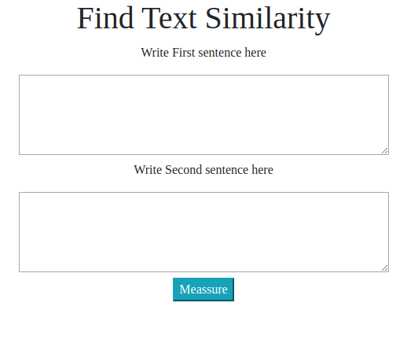

# Text Similarity App
## NLP containerized flask app

## Description

Webapp for measuring the cosine of similarity using spaCy.

Write two sentences and click on Meassure button to run the function.

## Testing the app

Clone the repository and build the docker image with:

`docker build -t text_similarity .`

Once done you can run the docker with:

`docker run -it -p 5000:5000 text_similarity`

The app can be tested accessing to **https://localhost:5000** 

## Unit Tests

Several Unit test can be done by executing:

`python tests.py`

